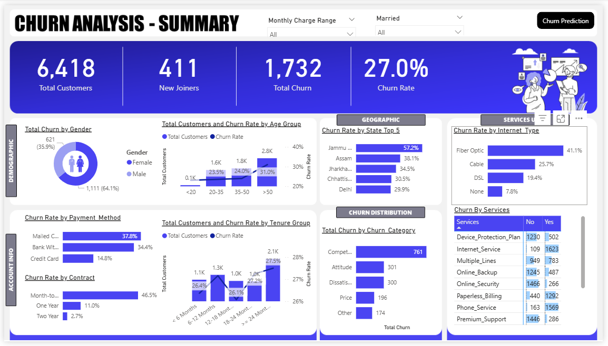
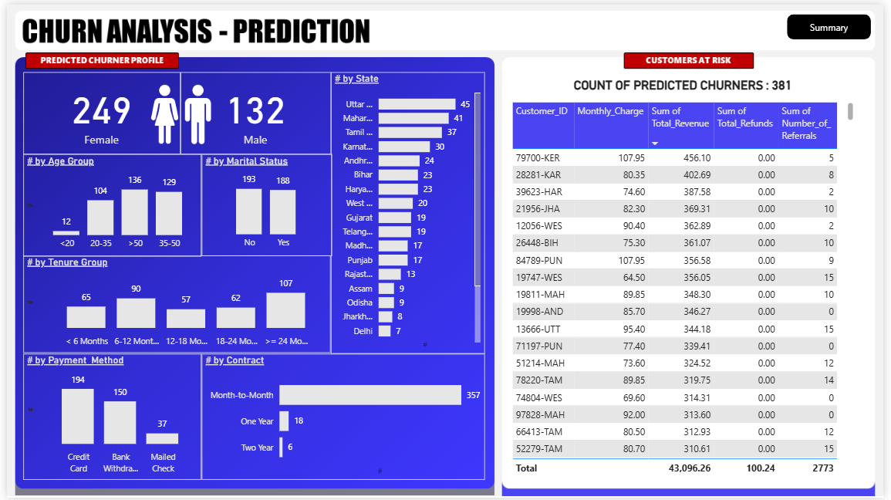

# 📉 Customer Churn Prediction & Analysis

This project demonstrates an end-to-end customer churn analysis pipeline, from data preprocessing and machine learning to business intelligence reporting using SQL, Power BI, and Python.

## 📌 Overview

Customer churn is a key metric in many industries, especially telecom. This project identifies potential churners using predictive modeling and provides deep insights via visual dashboards.

---

## 🛠️ Tools & Technologies

- 🐍 Python (Pandas, Scikit-learn, Matplotlib, Seaborn)
- 🗃️ SQL (Data Analysis Queries)
- 📊 Power BI (Dashboards, DAX, Power Query)
- 📑 Excel (Data Cleaning & Input)

---

## ⭐ Key Features

- ✅ Cleaned and visualized customer data
- ✅ Predictive ML model for identifying churners
- ✅ Segmentation by tenure, age group, and monthly charges
- ✅ Custom Power BI dashboards with DAX measures
- ✅ SQL-based churn and retention analysis

---

## 📷 Screenshots


<br>


---

## 🚀 How to Run

1. **Clone the repository**
   ```bash
   git clone https://github.com/yourusername/customer-churn-analysis.git
   ```
2. **Install Python dependencies**
   ```bash
   pip install -r requirements.txt
   ```
3. **Run Jupyter Notebook**  
Open `notebooks/Churn Prediction.ipynb` in Jupyter and run all cells.

4. **Open Power BI dashboard**  
Load `powerbi/Churn Analysis Dashboard.pbix` in Power BI Desktop.

---

## 🙋‍♂️ Author

**Md Shitab Salim**  

---

## ⚖️ License

This project is licensed under the MIT License.

---

⭐ *If you like this project, give it a star on GitHub and connect on LinkedIn!*
